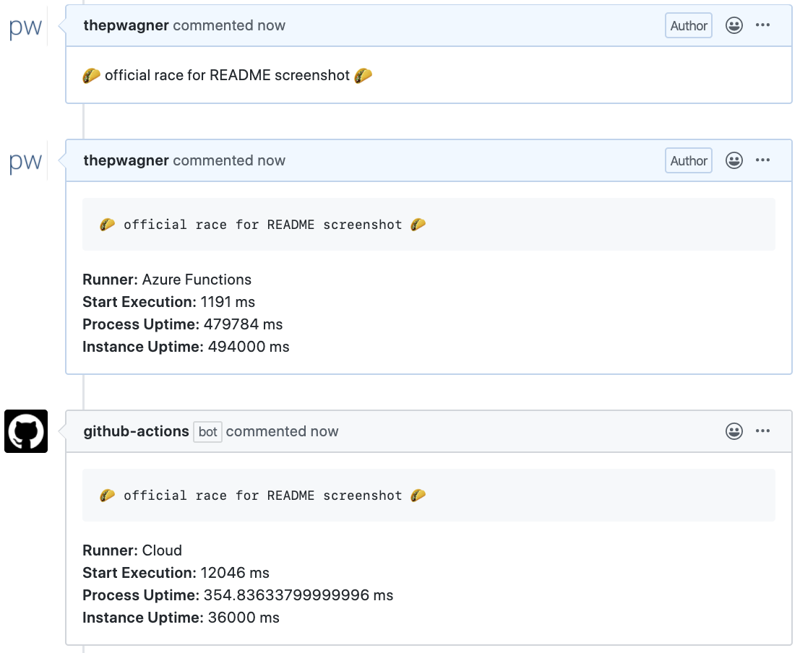

# FuncSoulBrother

This is a hack on porting existing GitHub Actions workflows to AzureFunctions invocations. Don't use it.

The idea is to leverage the GitHub Actions ecosystem, using a FaaS to run "light" Actions (e.g. responding to
issues/labels) much faster than Actions runners.

This is just an experiment, and is not supported. Don't use it.

The name refers to the hook of [The Rockafeller Skank](https://en.wikipedia.org/wiki/The_Rockafeller_Skank),
alluding to "function soul" at the heart of FaaS-friendly Actions and the repetitive nature of their invocation.
Quite silly.
